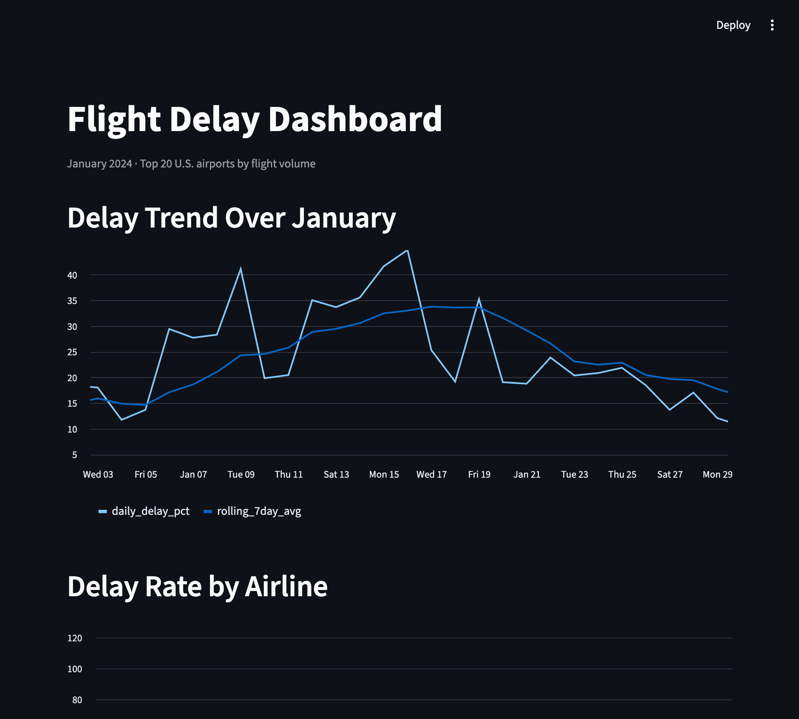

# Flight Delay Prediction with SQL + Machine Learning

A full data pipeline: sourcing real public data, designing a normalized 
relational schema, writing analytical SQL, and training and comparing ML 
classifiers, all built on Postgres and Python.

## Overview

This project predicts whether a U.S. domestic flight will arrive 15+ minutes 
late, using January 2024 flight records from the Bureau of Transportation 
Statistics (BTS) joined with NOAA weather data for the 20 busiest airports 
by flight volume.


## Tech Stack

- **Database:** PostgreSQL
- **Data processing:** Python, pandas, SQLAlchemy
- **Machine learning:** scikit-learn (Logistic Regression, Random Forest)
- **Data sources:** BTS On-Time Performance data, NOAA Local Climatological Data (LCD)

## Architecture

Three normalized Postgres tables (`airlines`, `airports`, `flights`) hold 
547,271 flight records for January 2024, linked by foreign keys. A fourth 
table (`weather`) holds daily weather summaries for the top 20 airports by 
flight volume, joined to `flights` on airport and date.

## SQL Analysis

Before any modeling, I used SQL directly to explore the data (see 
`sql/analysis.sql`):

- **Delay rate by airline:** ranged from 16.2% (Republic Airways) to 28.8% 
  (American Airlines)
- **Rolling 7-day delay trend:** delay rate climbed from ~11% to ~34% over 
  the course of January
- **Delay rate by time of day:** rose steadily from 15.5% (overnight) to 
  27.3% (evening), consistent with delays compounding through the day
- **Flights-weather join:** tested whether the January climb tracked with 
  weather. Found two distinct patterns: a clear precipitation spike on 
  Jan 9 (0.887" vs a typical 0.02-0.19") aligning with a delay spike 
  (41.5%), and a separate cold-temperature-driven pattern on Jan 15-17 
  (31-33°F) where delays stayed high despite low precipitation

## Machine Learning

Built a binary classifier (delayed vs. not-delayed, 15-minute threshold) 
using schedule and weather features. Cancelled and diverted flights were 
excluded, since their delay status isn't meaningfully defined.

| Model | Precision | Recall | AUC |
|---|---|---|---|
| Logistic Regression (unbalanced) | 0.70 | 0.11 | 0.663 |
| Logistic Regression (class-balanced) | 0.36 | 0.57 | 0.665 |
| Random Forest (class-balanced) | 0.45 | 0.54 | 0.733 |

**Key findings:**
- Class imbalance (only ~25% of flights are delayed) meant an unbalanced 
  model achieved misleadingly high precision by rarely predicting "delayed" 
  at all. Applying class weighting was necessary to get a model that catches delays.
- Random Forest outperformed Logistic Regression on AUC (0.733 vs 0.665), 
  likely because it can capture feature interactions (e.g. evening flights 
  during freezing weather) that a linear model can't.
- Feature importance from the Random Forest model confirms the SQL 
  findings: `precipitation` and `snowfall` were the two most important 
  features, ahead of scheduling factors like departure hour or flight 
  distance.

## Dashboard



Built with Streamlit, showing the delay trend over January, delay rate 
comparison across airlines, and delay rate plotted against weather 
conditions (precipitation and temperature). Run locally with:

```bash
streamlit run app.py
```

## Known Limitations

- Scope limited to the 20 busiest airports (by origin flight volume) for 
  weather data, since sourcing and mapping weather stations for all 334 
  airports in the dataset wasn't practical for v1.
- One month of data (January 2024). Results may reflect winter-specific 
  weather patterns and wouldn't necessarily generalize to other seasons.
- NOAA's "trace precipitation" values (marked "T" for immeasurably small 
  amounts) were rounded to 0, which slightly understates true precipitation 
  on those days.
- AUC around 0.73 suggests real but moderate predictive signal. Plenty of 
  what actually drives a specific flight's delay (aircraft rotation, air 
  traffic congestion, staffing) isn't present in schedule/weather data alone.
